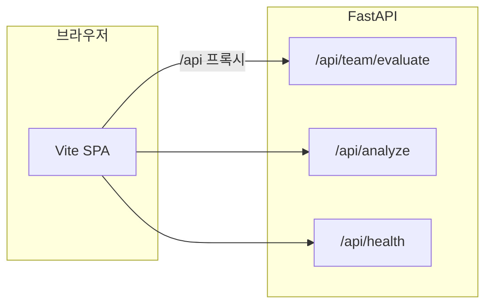

# 공모전 심사기준 대응서 (제출용)

본 문서는 심사위원이 **코드·문서만으로** 각 항목을 검증할 수 있도록 **근거 위치**를 명시합니다.

---

## 1. 기술적 완성도

| 심사 관점 | 본 프로젝트의 근거 | 확인 방법 |
|-----------|-------------------|-----------|
| 아키텍처 | **백엔드(FastAPI)**와 **프론트엔드(Vite/TS)** 분리, REST API | 저장소 구조, `GET /docs` OpenAPI |
| 안정성·재현 | **pytest** 회귀 테스트, **GitHub Actions CI** | `backend/tests/`, `.github/workflows/ci.yml` |
| 운영 추적 | 응답 **`X-Request-ID`**, 팀 평가 **`request_id`·`processing_ms`**, **`GET /api/observability`**(업타임·환경), **`GET /api/ready`**·**`/api/live`**(프로브) | 헤더·JSON·프론트 운영 콘솔 |
| 배포 | **Dockerfile** + **docker-compose** (선택) | 루트 `docker-compose.yml` |

---

## 2. AI 활용 능력 및 효율성

| 심사 관점 | 본 프로젝트의 근거 | 확인 방법 |
|-----------|-------------------|-----------|
| 다중 모델 | **Gemini·OpenAI·Claude·Grok** (과정–시험 분석 등) | `learning_analysis/pipeline.py` `asyncio.gather` |
| 병렬 처리 | 분석·비교 API에서 **동시 호출**로 지연 최소화 | 동일 파일, `compare_freeform.py` |
| 팀 평가 | OpenAI 키 시 **ThreadPoolExecutor**로 피드백·불일치 해설 **병렬** | `edu_tools/team.py` `_finalize_members` |
| 비용·환경 | API 키 **미설정 시 휴리스틱 폴백** | 키 없이 `POST /api/team/evaluate` 동작 |
| 투명성 | `GET /api/health`로 **제공자 설정 여부** 표시 | JSON `providers` |

---

## 3. 기획력 및 실무 접합성

| 심사 관점 | 본 프로젝트의 근거 | 확인 방법 |
|-----------|-------------------|-----------|
| 핵심 사용자 | **교수·조교·팀 과제** 맥락 | 팀 기여도 입력 필드(커밋·PR·동료 메모·결과 점수) |
| 워크플로우 | 결과 **JSON 내보내기·요약 복사·인쇄** | 팀 평가 결과 화면 |
| 확장 모듈 | 이탈 경보·피드백·Q&A·토론·루브릭 | `/api/at-risk`, `/api/feedback`, … |
| 윤리 | **교육 보조** 명시, 징계 단정 불가 안내 | README·응답 `disclaimer` |

---

## 4. 창의성

| 심사 관점 | 본 프로젝트의 근거 | 확인 방법 |
|-----------|-------------------|-----------|
| 기여 vs 결과 | **불일치(mismatch)**·요약 | `POST /api/team/evaluate` 응답 |
| 협업 시각화 | **네트워크 그래프** | 응답 `collaboration_network` |
| 역할·이상 | **4유형 역할**, **고급 이상 알림** | `contribution_type_label`, `anomaly_alerts` |
| 창의 인사이트 | **스토리라인·레이더·면담 질문·설명 카드·시뮬레이터** | 응답 `creative_insights`, 프론트 시뮬레이터 |

---

## 심사위원용 빠른 확인 API

- `GET /api/health` — 상태·버전·AI 키 설정
- `GET /api/version` — 앱 메타
- `GET /api/capabilities` — **심사 4축 요약·엔드포인트 목록** (기계 판독용 JSON)
- `GET /api/observability` — 업타임·환경·런타임 메타 (관측성)
- `GET /api/ready` · `GET /api/live` — 배포·K8s 스타일 헬스 프로브

---

*본 문서는 제출물의 일부로, 실제 운영 시 기관 규정·개인정보 보호를 우선합니다.*
